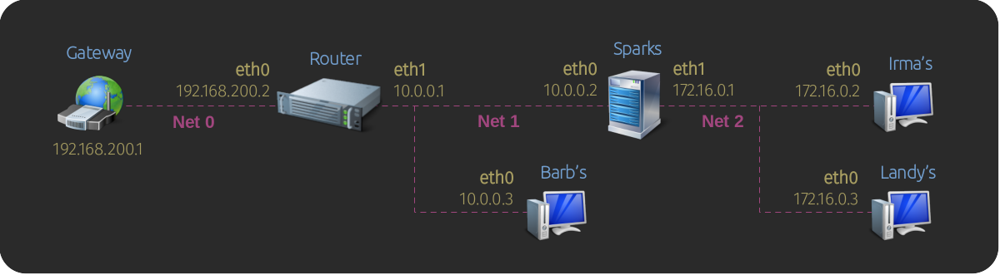

# Lab 1: The Everyday Essentials



                                                                                   
## Overview

This lab exercise is about tackling everyday networking problems. This network is broken down as follows: 
                                                                                              
- **Router** is the network's main router and allows the computers to reach the Internet.

- **Sparks** is a server with multiple network adapters and separates two networks.

- **Barb, Irma**, and **Landy** are casual users on the network.


## Building the Network

To build the network for this lab exercise do the following:

- Change into the `netlabs/` directory and run:
    
    ```bash
    ./netlabs.sh  build  router,0,1  irma,2  barb,1  landy,2  sparks,1,2
    
    ```
  
- Open shell terminals to all machines: 
                     
  - On graphical desktop environments run `./netlabs.sh terms` to open a new terminal window. 
  - If connecting via ssh to your test environment use `./netlabs.sh attach`, then to detach use CTRL-A, D. 


 
## Setting Up Router

Let's start by configuring the IP addresses and default gateway:
    
```bash
# The system has no routes
ip route   

# Add IP Addresses
sudo ip addr add 192.168.200.2/24 dev eth0

sudo ip addr add 10.0.0.1/24 dev eth1

# Show addresses
ip addr   

# Print routes
ip route   

# Ping our upstream gateway
ping  192.168.200.1   # OK

# Ping google dns server
ping  8.8.8.8   # fail 

# Add a default route for unknown networks;
# This tells the server where to forward traffic to
# for addresses it doesn't know how to reach.
sudo ip route add default via 192.168.200.1   

# Print routes, notice the default gateway
ip route  

# Ping google dns server again
ping  8.8.8.8  # OK

# Ping google's domain name
ping google.com  # fail

```

Since this computer is not configured via DHCP by another
server, we need to set up our DNS servers manually.

In modern Linux systems, name resolution is typically managed by the
_systemd-resolved_ service. To set the DNS servers, we need to add a
configuration for _systemd-resolved_ as follows:
                            
```bash
# If the folder /etc/systemd/resolved.conf.d does not exist, create it
sudo mkdir -p /etc/systemd/resolved.conf.d 

# Create a file with *.conf extension, so it is read by the service
# and specify our DNS servers
cat <<EOF | sudo tee /etc/systemd/resolved.conf.d/manual-dns.conf
[Resolve]
DNS=8.8.8.8  8.8.4.4
EOF

# Show the config file contents
cat /etc/systemd/resolved.conf.d/manual-dns.conf

# Restart systemd-resolved
sudo systemctl restart systemd-resolved  

# Ping google's domain name
ping google.com    # Ok

```

To learn more about _systemd-resolved_ settings, see 
[resolved.conf(5)](https://www.man7.org/linux/man-pages/man5/resolved.conf.5.html).
                   

## Setting Up Barb's Computer

Configure the IP address and default gateway:

```bash
# Set the IP address
sudo ip addr add 10.0.0.3/24 dev eth0

# Ping the local gateway
ping  10.0.0.1  # OK

# Ping the next gateway up
ping  192.168.200.1   # Fail

# Print routes
ip route

```

The ping command above fails because we don't know where 192.168.200.1 is,
and we don't have a default route to forward unknown addresses traffic. 

```bash
# Monitor traffic on Router with
sudo tcpdump -i any -ln icmp  

# Add default route for unknown networks in Barb's.
# Any traffic for addresses that Barb doesn't know 
# will be forwarded to 10.0.0.1 
sudo ip route add default via 10.0.0.1   

ip route  # list routes, notice the default route

ping -c 1 192.168.200.1  # Fail, look tcp dump on Router

```

The reason ping is failing is that _Router_ has not been configured to
work as a gateway yet, and it is not forwarding traffic.

To turn _Router_ into a gateway, we need to do two things:

- Enable packet forwarding. This tells Router that it is going to
  do packet routing on behalf of other computers in the network.

- Masquerade the source IP address of any packet being forwarded to the
  upstream network as if it came from Router itself, not the original
  local computer that sent it.
  
In the _Router_ terminal do the following:

```bash
# Enable forwarding
sudo sysctl -w net.ipv4.ip_forward=1  

# Confirm forwarding is enabled, should print 1
cat /proc/sys/net/ipv4/ip_forward

# Use the iptables command to create a network address translation (NAT) rule to
# masquerade traffic heading from the 10-network to the upstream gateway as if it 
# was from Router's. This rule says: 
#  --any packet with source IP matching 10.0.0.0/24 heading out eth0 needs masquerading
sudo iptables -t nat -A POSTROUTING --source 10.0.0.0/24  -o eth0  -j MASQUERADE 

# list nat rules
sudo iptables -t nat -nv -L POSTROUTING --line-numbers

```
   
With _Router_ now properly configured do:

```bash
# Monitor traffic on Router with
sudo tcpdump -i any -ln icmp  

# Run ping tests on Barb 
ping -c 1 192.168.200.1  # OK, check tcp dump on Router

ping -c 1 8.8.8.8  # OK, check tcp dump on Router

```
              


## Setting Up Sparks

Configure the IP addresses and default gateway:

```bash
# Assign IP addresses
sudo ip addr add 10.0.0.2/24 dev eth0 

sudo ip addr add 172.16.0.1/24 dev eth1

# Print routes
ip route   

# Monitor traffic on Router
sudo tcpdump -i any -ln icmp 

ping -c 1 10.0.0.1   # OK

ping -c 1 192.168.200.1   # Fail, no default route

# Sparks doesn't know where to send unknown traffic,
# so add default route for unknown networks
sudo ip route add default via 10.0.0.1   

# Print routes
ip route   

# Test
ping -c 1 192.168.200.1   # OK because of masquerade earlier

ping -c 1 8.8.8.8   # OK

```


## Setting Up Irma's Computer
         
Configure the IP address and default gateway:

```bash
# Set IP address
sudo ip addr add 172.16.0.2/24 dev eth0

# Print routes
ip route   

# Monitor traffic on Sparks
sudo tcpdump -i any -ln icmp    

ping -c 1 172.16.0.1 # OK

ping -c 1 10.0.0.1    # Fail, no default route

# Irma's computer doesn't know where to send unknown traffic,
# so add default route for unknown networks
sudo ip route add default via 172.16.0.1    

# Print routes, notice the default 
ip route  
                         
# Ping the upstream gateway
ping -c 1 10.0.0.1     # Fail?

```

Same as _Router_ before, the reason ping is failing is that _Sparks_ 
has not been configured to be a gateway.
                   
Go to the _Sparks_ terminal, enable IP forwarding, then try  
pinging again from Irma's terminal:

```bash
# Show current forwarding setting in Sparks
cat /proc/sys/net/ipv4/ip_forward

# Enable forwarding in Sparks
sudo sysctl -w net.ipv4.ip_forward=1  

# Confirm forwarding is enabled in Sparks, should print 1
cat /proc/sys/net/ipv4/ip_forward

# Monitor traffic on Sparks AND Router
sudo tcpdump -i any -ln icmp    

# Ping the upstream gateway from Irma's
ping -c 1 10.0.0.1  # Fail?

```

The ping from Irma's continues to fail. We intentionally left out
the step of enabling masquerading on _Sparks_ to show a point.

If you follow the ping breadcrumbs from _Sparks_ to _Router_ you'll
notice the ping request made it to _Router_ but the packet arrived
with Irma's 172-network's IP. _Router_ doesn't know where the 172-network is,
so it does what a computer does when the destination address is unknown:
send it to its default gateway-- that ping response is never coming back.

To fix this, we add a masquerading rule to _Sparks_: any traffic going from
the 172-network to the 10-network is masqueraded with _Sparks_ 10-network IP:

```bash
# On Sparks, masquerade traffic heading from the 172-network to the 10-network 
sudo iptables -t nat -A POSTROUTING --source 172.16.0.0/24  -o eth0  -j MASQUERADE 

```
    
Monitor traffic on _Sparks_ and _Router_ and try pinging from _Irma's_ again:

```bash
# Monitor traffic on Sparks AND Router
sudo tcpdump -i any -ln icmp    

# Ping the upstream gateway from Irma's
ping -c 1 10.0.0.1  # ok?

ping -c 1 8.8.8.8  # ok?


```


## Setting Up Landy's Computer

Configure the IP address and default gateway:

```bash
# Set IP address
sudo ip addr add 172.16.0.3/24 dev eth0

ping 172.16.0.1 # OK to ping Sparks

ping 172.16.0.2 # OK to ping Irma's

ping 10.0.0.1   # Fail, Landy doesn't know how to get to the 10-network

# Add Landy's default route for unknown networks
sudo ip route add default via 172.16.0.1   

ip route  # print routes, notice the default

ping 10.0.0.1 # OK, sparks is masquerading 172<-->10 traffic

ping 8.8.8.8  # OK, sparks is masquerading 172<-->10 traffic


```

## Make Barb Access the 172-Network
                                   
Barb now needs access to Irma's and Landy's computers.

Do the following:

```bash
# Monitor traffic on Router, Sparks and Irma's
sudo tcpdump -i any -ln icmp   

# On Barb's, ping Irma's
ping -c 1 172.16.0.2  # Fail ?    

# Print Barb's routes
ip route  

```      

Barb's computer doesn't know how to get to the 172-network, and as expected,
all her traffic heads over to the default gateway, 10.0.0.1, and gets lost upstream. 
          
To fix this, we need to tell Barb's computer that the 127-network is through _Sparks_:

```Bash
# Add route to the 172-network on Barb's
sudo ip route add 172.16.0.0/24 via 10.0.0.2

ip route  # print routes, note 172 is via Sparks

# Continue to monitor traffic on Router, Sparks and Irma's
sudo tcpdump -i any -ln icmp   

# On Barb's, ping Irma's
ping -c 1 172.16.0.2  # OK ? 

```

Notice that _Sparks_ is not masquerading traffic from the 10-network to the 172-network.
_Irma_ received the ping request from _Barb's_ 10-network IP, not from _Sparks_ 172-network IP.
Since _Irma_ has no idea how to reach _Barb's_ 10-network IP, it replies using her 
default gateway, which happens to be _Sparks_, which knows how to get to _Barb's_ original IP 
address. In this case, masquerading traffic from the 10-network to the 172-network is optional.

However, had _Sparks_ not been _Irma's_ default gateway, the ping reply
would have been lost. To avoid possible issues in the future, we could play safe
and add a NAT rule in _Spark_ to masquerade traffic from the 10-network to the 172-network as 
follows:

```bash
# Masquerade traffic from the 10- to the 172-network
sudo iptables -t nat -A POSTROUTING --source 10.0.0.0/24 --destination 172.16.0.0/24 -j MASQUERADE 

# List nat rules
sudo iptables -t nat -nv -L POSTROUTING --line-numbers 

# Continue to monitor traffic on Router, Sparks and Irma's
sudo tcpdump -i any -ln icmp   

# Test Barb's access to the 172-network
ping -c 1 172.16.0.2   # ping Irma's

ping -c 1 172.16.0.3   # ping Landy's

curl 172.16.0.2   # get Irma's website

curl 172.16.0.3   # get Landy's website

ssh 172.16.0.2   # ssh to Irma's

ssh 172.16.0.3   # ssh to Landy's

```


## Securing the 172-Network 

_Barb_ has been frequently lurking around the 172-network, which _Irma_ and _Landy_ 
are not happy about. They've requested stronger security measures.

To address this, _Sparks_ can be configured as a firewall, restricting access 
to specific traffic. This can be achieved using _iptables_.

The `iptables` command is used to filter and manipulate network traffic. It operates on a set 
of rules that are stored into _chains_. These chains are:

- _INPUT_ has rules for handling packets destined for the local system
- _OUTPUT_ has rules for handling packets originating from the local system
- _FORWARD_ has rules for managing packets routed through the system, heading to other systems
- _PREROUTING_ has rules for modifying packets before routing decisions (i.e., changing destination addresses or ports)
- _POSTROUTING_ has rules for modifying packets after routing decisions (i.e., masquerading or SNAT)
    
            
Before we begin, let's wipe clean our _filter_ and _nat_ tables by flushing all rules:

  > [!CAUTION]
  > If you are working remotely over ssh, make sure your default policies are set to ACCEPT
  > before flushing out your filter and nat tables rules. Otherwise, you might end up 
  > locking yourself out!

```bash
# Before flushing, list filter table rules, make sure default policies
# are set to ACCEPT
sudo iptables -nvL --line-numbers   

# Wipe all rules to start a fresh configuration
sudo iptables -F          # flush all rules in the filter table

sudo iptables -t nat -F   # flush all rules in the nat table


# As of now, there are no rules in the filter and nat tables
sudo iptables -nvL --line-numbers   # list filter table rules

sudo iptables -t nat -nv -L PREROUTING --line-numbers && \
  sudo iptables -t nat -nv -L POSTROUTING --line-numbers   # list nat table rules

```
                                                                                  
Throughout the rest of the tutorial, we are going to refer to the 10-network as 
"the outside" and the 172-network as "the inside" of the firewall.

The first rules allow all _localhost_ (lo) and 172-network (eth1) traffic to flow in:

```bash
# Allow localhost traffic on the loopback interface
sudo iptables -A INPUT -i lo -j ACCEPT   

# Allow all 172 traffic to come in on eth1
sudo iptables -A INPUT -i eth1 -j ACCEPT   

```
   
Any traffic forwarded from the 172-network to the outside (eth0 <-- eth1) is allowed
and masqueraded. ONLY responses to traffic initiated from the 172-network are allowed 
back in, and masqueraded.

```bash
# Allow outgoing 172 traffic to the outside
sudo iptables -A FORWARD -i eth1 -o eth0 -j ACCEPT   

# Masquerade traffic leaving 172 net
sudo iptables -t nat -A POSTROUTING --source 172.16.0.0/24 -o eth0 -j MASQUERADE   


# Allow responses to traffic initiated from 172 to return 
# This excludes traffic initiated from the outside
sudo iptables -A FORWARD -i eth0 -o eth1 -m state --state RELATED,ESTABLISHED -j ACCEPT   

# Masquerade traffic forwarded from the outside to the 172-network
sudo iptables -t nat -A POSTROUTING -o eth1 --destination 172.16.0.0/24 -j MASQUERADE 

```
   
Allow incoming TCP packets that are not "SYN packets," meaning 
they are part of an established or related connection rather than a new one. It ensures 
that only already-established connections or responses to existing connections are accepted:

```bash
# allow established TCP connection traffic to return
sudo iptables -A INPUT -p tcp ! --syn -j ACCEPT   

```
   
When computers on the 172-network contact an external DNS server to do name resolution,
the response comes back over UDP with a source port of 53. We need to allow those responses
through for DNS to work in the 172-network:

```bash
# Allow incoming DNS queries responses from source port 53
sudo iptables -A INPUT -p udp --sport 53 -j ACCEPT  

```
   
Allow _Sparks_ to be ping'ed:

```bash
# Allow icmp traffic
# The time limits are used to guard against ping flood DDoS attacks 
#   -m limit: Enables rate limiting.
#   --limit 1/second: Limits the rule to one ping request per second.
#   --limit-burst 5: Allows up to 5 pings in a short burst before rate limiting 
# In a production environment, you may opt out from responding pings altogether 
sudo iptables -A INPUT  -p icmp --icmp-type echo-request   -m limit --limit 1/second --limit-burst 5  -j ACCEPT

# Allow incoming ping replies back in
sudo iptables -A INPUT -p icmp --icmp-type echo-reply -j ACCEPT \
              -m state --state ESTABLISHED,RELATED   

```

Remap _Sparks_ ssh server to port 2222 and only allow connections
from _Router_ so that _Barb_ can't hack her way in so easily:

```bash
# Make sparks ssh server available on port 2222 
sudo iptables -t nat -A PREROUTING -i eth0 -p tcp \
              --dport 2222 -j REDIRECT --to-ports 22  # port redirect :2222 --> :22

# In addition to the REDIRECT above, we still need to allow connections on port 22, coming from Router's only
sudo iptables -A INPUT -i eth0 --source 10.0.0.1 -p tcp --dport 22 -m state --state NEW,ESTABLISHED  -j ACCEPT  

```
 
Let's take a look at our rules:

```bash
# Review rules in the filter and nat tables
sudo iptables -nvL --line-numbers   # list filter table rules

sudo iptables -t nat -nv -L PREROUTING --line-numbers && \
  sudo iptables -t nat -nv -L POSTROUTING --line-numbers   # list nat table rules

```

We have the minimum required rules for _Sparks_ to work, and at this point,
we can close it up by setting the default policies on each filter chain to DROP.
What this means is that any packet that does not match any of the rules above 
will be dropped.

  > [!CAUTION]
  > If you are connected remotely over ssh, make sure you have an ssh rule that lets you back in,
  > otherwise you will lock yourself out after setting the chains default policies to DROP.
                                                                           
```bash
# list filter table rules, note ACCEPT policy is the default
sudo iptables -nvL --line-numbers   

# Set the chains default policies
sudo iptables -P INPUT DROP      # drop any incoming traffic not matching any rules above

sudo iptables -P FORWARD DROP    # drop any forwarding traffic not matching any rules above

sudo iptables -P OUTPUT ACCEPT   # allow all outgoing traffic (default)

# list filter table rules, note DROP policy is now the default
sudo iptables -nvL --line-numbers   

```          

With _Sparks_ and the 172-network now locked down, let's see what _Barb_ can do:
      

```bash
# Test from Barb's
ping 10.0.0.2     # ok, ping sparks

curl 10.0.0.2     # fail, no sparks web access

ssh 10.0.0.2      # fail, no sparks ssh

ssh -p 2222 10.0.0.2  # fail, Barb found out about port 2222 but no luck; try also from Router


ping 172.16.0.2   # fail, no ping Irma's

curl 172.16.0.2   # fail, no Irma's web access

ssh 172.16.0.2    # fail, no Irma's  ssh


ping 172.16.0.3   # fail, no ping Landy's

curl 172.16.0.3   # fail, no Landy's web access

ssh 172.16.0.3    # fail, no Landy's ssh


```
       
Barb is furious; she insists that she needs web access to _Sparks_ and _Irma's_ and
ssh access to Landy's computer.

Make the adjustments:

```bash
# Make Sparks web server available on port 8888
sudo iptables -t nat -A PREROUTING -i eth0 -p tcp \
              --dport 8888 -j REDIRECT --to-ports 80  # port redirect :8888 --> :80

# In addition to the REDIRECT above, we still need to allow connections on port 80
sudo iptables -A INPUT -i eth0 -p tcp --dport 80 -m state --state NEW,ESTABLISHED -j ACCEPT  


# Redirect sparks port 80 to Irma's port 80
sudo iptables -t nat -A PREROUTING -i eth0 -p tcp \
              --dport 80 -j DNAT --to-destination 172.16.0.2:80  # sparks:80 --> irmas:80 port mapping

# In addition to the DNAT rule above, we still need to allow port 80 forwarded traffic out eth1 to occur
sudo iptables -A FORWARD  -o eth1 -p tcp --dport 80  -j ACCEPT   


# Redirect sparks port 22 to Landy's port 22
sudo iptables -t nat -A PREROUTING -i eth0 -p tcp \
              --dport 22 -j DNAT --to-destination 172.16.0.3:22  # sparks:22 --> landys:22  port mapping

# In addition to the DNAT rule above, we still need to allow port 22 forwarded traffic out eth1 to occur
sudo iptables -A FORWARD  -o eth1 -p tcp --dport 22  -j ACCEPT   

```

Let's take a look at our rules:

```bash
# Review rules in the filter and nat tables
sudo iptables -nvL --line-numbers   # list filter table rules

sudo iptables -t nat -nv -L PREROUTING --line-numbers && \
  sudo iptables -t nat -nv -L POSTROUTING --line-numbers   # list nat table rules

```

Confirm _Barb's_ new access:  

```bash

# Test from Barb's
curl 10.0.0.2        # access Irma's website via Sparks:80

ssh 10.0.0.2         # ssh into Landy's via Sparks:22

curl 10.0.0.2:8888   # access Sparks website

``` 
                     


# Make Configurations Persistent

All the configurations we made above are volatile and will be lost when the systems reboot.
The next sections discuss how to make each system configuration persistent.
                            


          
## Save Router's Configuration

Use the `iptables-save` command to save the current `iptables` rules to a file; 
the file location is arbitrary:

```bash
# Save current rules
sudo sh -c "iptables-save > /etc/iptables-rules.v4" 

```

Append instructions to the `/etc/rc.local` boot script to restore both forwarding
and `iptables` rules after boot: 

```bash
cat <<EOF | sudo tee -a /etc/rc.local
#!/bin/sh

# restore forwarding
sysctl -w net.ipv4.ip_forward=1

# restore rules
$(which iptables-restore) < /etc/iptables-rules.v4
EOF

# make file executable if not already done so
sudo chmod +x /etc/rc.local

```
Note that if `/etc/rc.local` does not exist it will be created.

Alternatively, you could enable forwarding permanently by editing `/etc/sysctl.conf`
and adding, or uncommenting, the line `net.ipv4.ip_forward=1`. Either way is fine.

```bash
sudo nano /etc/sysctl.conf

```

IP addresses, default routes, and DNS servers are configured using
[Netplan](https://netplan.readthedocs.io/en/latest/netplan-yaml/),
a utility for network configuration on Linux systems. 

Netplan uses YAML files located in the `/etc/netplan` folder:                                                      
   
```bash
# Show factory netplan configuration
ls -l /etc/netplan/*

sudo cat /etc/netplan/*   # default config is DHCP


# Remove the default config, you may back up this folder if you like
sudo rm /etc/netplan/* 

# Set IPs, default route,  and DNS servers
cat <<EOF | sudo tee /etc/netplan/my-network-config.yaml 
network:
  version: 2
  ethernets:
    eth0:
      dhcp4: false
      addresses:
        - 192.168.200.2/24
      routes:
        - to: default
          via: 192.168.200.1
      nameservers:
        addresses: [8.8.8.8, 8.8.4.4]
    eth1:
      dhcp4: false
      addresses:
        - 10.0.0.1/24
EOF

# Limit file access to root only
sudo chmod 600 /etc/netplan/* 

# Apply netplan config
sudo netplan apply

```

The above configuration does:

  - Assigns `192.168.200.2` to `eth0` so that we can talk to the upstream gateway. 
    Note DHCP is disabled in this interface as well.
  - Sets the default route via the `192.168.200.1` gateway.
  - Set the DNS server to `8.8.8.8, 8.8.4.4`. 
  - Assigns `10.0.0.1` to `eth1` and disable DHCP in this interface too.

            
At this point, _Router_ can be rebooted and its configuration should come backup.
                                                

```bash
sudo reboot

# Check IP addresses, forwarding, and nat rules after reboot
ip -brief addr

sysctl net.ipv4.ip_forward

sudo iptables -t nat -nv -L POSTROUTING --line-numbers

# Check Internet
ping google.com


```

          


## Save Sparks Configuration

Save the current `iptables` rules to a file:

```bash
# Save current rules
sudo sh -c "iptables-save > /etc/iptables-rules.v4" 

```

Modify the `/etc/rc.local` boot script to restore both forwarding
and `iptables` rules after boot: 

```bash
cat <<EOF | sudo tee -a /etc/rc.local
#!/bin/sh

# restore forwarding
sysctl -w net.ipv4.ip_forward=1

# restore rules
$(which iptables-restore) < /etc/iptables-rules.v4
EOF

# make file executable if not already done so
sudo chmod +x /etc/rc.local

```
 
Create _netplan_ configuration file to set up IP addresses, default route,
and DNS servers:                                                  
   
```bash
# Remove the default config, you may back up this folder if you like
sudo rm /etc/netplan/* 

# Set IPs, default route,  and DNS servers
cat <<EOF | sudo tee /etc/netplan/my-network-config.yaml 
network:
  version: 2
  ethernets:
    eth0:
      dhcp4: false
      addresses:
        - 10.0.0.2/24
      routes:
        - to: default
          via: 10.0.0.1
      nameservers:
        addresses: [8.8.8.8, 8.8.4.4]
    eth1:
      dhcp4: false
      addresses:
        - 172.16.0.1/24
EOF

# Limit file access to root only
sudo chmod 600 /etc/netplan/* 

# Apply netplan config
sudo netplan apply

```
 
Reboot and check configuration:                                              

```bash
sudo reboot

# Check IP addresses, forwarding, and nat rules after reboot
ip -brief addr

# Forwarding?
sysctl net.ipv4.ip_forward

# List filter table rules
sudo iptables -nvL --line-numbers   

# List nat table rules
sudo iptables -t nat -nv -L PREROUTING --line-numbers && \
  sudo iptables -t nat -nv -L POSTROUTING --line-numbers   

# Check Internet
ping google.com

# Check Router can ssh into Spark
ssh -p 2222 10.0.0.2

```

              


## Save Irma's Configuration
 
Create _netplan_ configuration file to set up IP addresses, default route,
and DNS servers:                                                  
   
```bash
# Remove the default config, you may back up this folder if you like
sudo rm /etc/netplan/* 

# Set IPs, default route,  and DNS servers
cat <<EOF | sudo tee /etc/netplan/my-network-config.yaml 
network:
  version: 2
  ethernets:
    eth0:
      dhcp4: false
      addresses:
        - 172.16.0.2/24
      routes:
        - to: default
          via: 172.16.0.1
      nameservers:
        addresses: [8.8.8.8, 8.8.4.4]
EOF

# Limit file access to root only
sudo chmod 600 /etc/netplan/* 

# Apply netplan config
sudo netplan apply

```
 
Reboot and check configuration:                                              

```bash
sudo reboot

# Check IP addresses after reboot
ip -brief addr

# Check Internet
ping google.com


```
        


## Save Landy's Configuration
 
Create _netplan_ configuration file to set up IP addresses, default route,
and DNS servers:                                                  
   
```bash
# Remove the default config, you may back up this folder if you like
sudo rm /etc/netplan/* 

# Set IPs, default route,  and DNS servers
cat <<EOF | sudo tee /etc/netplan/my-network-config.yaml 
network:
  version: 2
  ethernets:
    eth0:
      dhcp4: false
      addresses:
        - 172.16.0.3/24
      routes:
        - to: default
          via: 172.16.0.1
      nameservers:
        addresses: [8.8.8.8, 8.8.4.4]
EOF

# Limit file access to root only
sudo chmod 600 /etc/netplan/* 

# Apply netplan config
sudo netplan apply

```
 
Reboot and check configuration:                                              

```bash
sudo reboot

# Check IP addresses after reboot
ip -brief addr

# Check Internet
ping google.com


# Tests
curl 172.16.0.1   # get Sparks website

curl 172.16.0.2   # get Irma's website

curl 10.0.0.1     # get Router's website


ssh 172.16.0.1    # ssh to Sparks's

ssh 172.16.0.2    # ssh to Irma's 

ssh 10.0.0.1      # ssh to Router's 

```
             


## Save Barb's Configuration
 
Create _netplan_ configuration file to set up IP addresses, default route,
and DNS servers:                                                  
   
```bash
# Remove the default config, you may back up this folder if you like
sudo rm /etc/netplan/* 

# Set IPs, default route, and DNS servers
# Note: we are still adding her original 172-network route for completeness, 
#       which no longer works after Sparks was turned into a firewall
cat <<EOF | sudo tee /etc/netplan/my-network-config.yaml 
network:
  version: 2
  ethernets:
    eth0:
      dhcp4: false
      addresses:
        - 10.0.0.3/24
      routes:
        - to: default
          via: 10.0.0.1
        - to: 172.16.0.0/24
          via: 10.0.0.2
      nameservers:
        addresses: [8.8.8.8, 8.8.4.4]
EOF

# Limit file access to root only
sudo chmod 600 /etc/netplan/* 

# Apply netplan config
sudo netplan apply

```
 
Reboot and check configuration:                                              

```bash
sudo reboot

# Check IP addresses and routes after reboot
ip -brief addr

ip route

 
# Check Internet
ping google.com


# Tests
ping 10.0.0.2        # ok, ping sparks

curl 10.0.0.2        # access Irma's website via Sparks:80

ssh 10.0.0.2         # ssh into Landy's via Sparks:22

curl 10.0.0.2:8888   # access Sparks website


```


                
 


