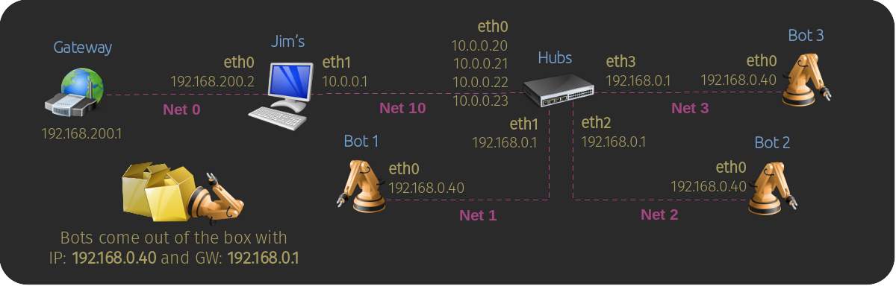

# Lab 2: The Out-of-the-box Problem


             
## Overview

This lab exercise demonstrates the concept of routing with packets by use of marks.  
                                                                                                         
Jim uses a computer to configure robots before they are shipped to customers. 
Out of the box, robots have a static IP address of _192.168.0.40_ with a _192.168.0.1_ gateway, 
restricting the network to have one robot connected at a time and slowing down the process. 
To streamline this, Jim is adding a hub that connects to multiple robots and assigns them 
unique temporary IP addresses while preserving their factory static IP settings. 
This enables simultaneous configuration of multiple robots, improving productivity.

                 
This network is broken down as follows:

- **Jim's** computer is used to configure the robots and also serves as a gateway that allows 
  them to reach the Internet.

- **Hubs** is a small form factor fanless Linux PC with four Ethernet ports. It assigns
  each robot a unique IP, so that each can be reached from Jim's computer. _eth0_ is used to connect
  to the 10-network, while _eth1, eth2,_ and _eth3_ are used to connect robots.

- **Bot1, Bot2**, and **Bot3** are the robots to be configured. They also need access to the internet
  to download software updates.


## Building the Lab Network

To build the network for this lab exercise do the following:

- Change into the `netlabs/` directory and run:
    
    ```bash
    ./netlabs.sh  build  jim,0,10  bot1,1  bot2,2  bot3,3  hubs,10,1,2,3
    
    ```
  
- Open shell terminals to all machines: 
                     
  - On graphical desktop environments run `./netlabs.sh terms` to open a new terminal window. 
  - If connecting via ssh to your test environment use `./netlabs.sh attach`, then to detach use CTRL-A, D. 


 

## Setting Up Jim's Computer
                              
       
Let's start by configuring the IP addresses and the default gateway route:
    
```bash
# Add IP address
sudo ip addr add 192.168.200.2/24 dev eth0

sudo ip addr add 10.0.0.1/24 dev eth1

ip route   # check routes   

# Add default route for unknown networks
sudo ip route add default via 192.168.200.1

ip route   # check routes   

# Confirm we can reach the internet
ping -c 1 192.168.200.1   # OK

ping -c 1 8.8.8.8   # OK

```
    

### Enable Forwarding

To make **Jim's** computer work as an Internet gateway for the robots, we need to enable packet forwarding:

```bash
# Enable forwarding
sudo sysctl -w net.ipv4.ip_forward=1  

# Check forwarding is enabled, should print 1
cat /proc/sys/net/ipv4/ip_forward

```

### Masquerade Upstream Outgoing Traffic    

To ensure the packets forwarded to upstream gateways can return back to us, we need to masquerade
the original source IP address as if it was ours. To do this, we use the `iptables` command
as follows:

```bash
# Masquerade traffic forwarded upstream to other gateways as if it was ours
sudo iptables -t nat -A POSTROUTING --source 10.0.0.0/24 -o eth0 -j MASQUERADE

# List nat rules
sudo iptables -t nat -nvL --line-numbers  

```

The above rule is added to `POSTROUTING` chain of the `nat` table; which holds rules 
for packets about to leave the machine. The rule says that any packet coming from 
the `10.0.0.0/24` network and leaving the `eth0` interface needs to be masqueraded, 
i.e., the packet's source IP address is replaced with the server's IP assigned to 
the interface where the packet is leaving from: `eth0` has IP _192.168.200.2_.
               

### Make Configuration Persistent

The settings above will be lost after a reboot. We use the `iptables-save` command
to save the current `iptables` rules to a file; the file location is arbitrary:

```bash
# Save current rules
sudo sh -c "iptables-save > /etc/iptables-rules.v4" 

```

Then we append instructions to the `/etc/rc.local` boot script to restore both forwarding
and `iptables` rules after boot. 

```bash
cat <<EOF | sudo tee -a /etc/rc.local
#!/bin/sh

# restore forwarding
sysctl -w net.ipv4.ip_forward=1

# restore rules
$(which iptables-restore) < /etc/iptables-rules.v4
EOF

# make file executable if not already done so
sudo chmod +x /etc/rc.local

```

Note that if `/etc/rc.local` does not exist it will be created.

Alternatively, you could enable forwarding permanently by editing `/etc/sysctl.conf`
and adding, or uncommenting, the line `net.ipv4.ip_forward=1`. Either way is fine.

```bash
sudo nano /etc/sysctl.conf

```


### Configure Network Interfaces

To configure the network interfaces, we are going to create a _netplan_ configuration

   
```bash
# Remove the default config, you may back up this folder if you like
sudo rm /etc/netplan/* 

# Set IPs, default route, and DNS servers
cat <<EOF | sudo tee /etc/netplan/my-network-config.yaml 
network:
  version: 2
  ethernets:
    eth0:
      dhcp4: false
      addresses:
        - 192.168.200.2/24
      routes:
        - to: default
          via: 192.168.200.1
      nameservers:
        addresses: [8.8.8.8, 8.8.4.4]
    eth1:
      dhcp4: false
      addresses:
        - 10.0.0.1/24
EOF

# Limit file access to root only
sudo chmod 600 /etc/netplan/* 

# Apply netplan config
sudo netplan apply

```

The above configuration does:

  - Assigns `192.168.200.2` to `eth0` so that we can talk to the upstream gateway. 
    Note DHCP is disabled in this interface as well.
  - Sets the default route via the `192.168.200.1` gateway.
  - Set the DNS server public DNS servers to _8.8.8.8_ and _1.1.1.1_.
  - Assigns `10.0.0.1` to `eth1` and disable DHCP in this interface too.

   


At this point, we might restart _Jim's_ computer and see if the configuration persists.

```bash
# Restart server
sudo reboot

# list nat rules
sudo iptables -t nat -nvL --line-numbers  

# Show current forwarding setting
sysctl net.ipv4.ip_forward  

```
          

## Setting Up the Robots

To mimic the out-of-the-box factory settings, apply the following _netplan_
configuration to all the robots:

```bash    
# Remove the default config, you may back up this folder if you like
sudo rm /etc/netplan/* 

# Apply robot factory settings
# Set IPs, default route, and DNS servers
cat <<EOF | sudo tee /etc/netplan/my-network-config.yaml
network:
  version: 2
  ethernets:
    eth0:
      dhcp4: false
      addresses:
        - 192.168.0.40/24
      routes:
        - to: default
          via: 192.168.0.1
      nameservers:
        addresses: [8.8.8.8, 8.8.4.4]
EOF

# Limit file access to root only
sudo chmod 600 /etc/netplan/* 

# Apply netplan config
sudo netplan apply

```
      
Although the robots are configured, they will not be accessible 
until the **Hubs** configuration is complete.


## Setting Up Hubs
                            
**Hubs** is going to have four static IP addresses on _eth0_ facing the 10-network:

- 10.0.0.20 is going to be the host's IP address
- 10.0.0.21 is going to be used to masquerade a robot connected on _eth1_
- 10.0.0.22 is going to be used to masquerade a robot connected on _eth2_
- 10.0.0.23 is going to be used to masquerade a robot connected on _eth3_
                                                                        
On the robot's side, _eth1_, _eth2_, and _eth3_ all will have the IP address _192.168.0.1_. 

Let's configure these interfaces and monitor the output of the `ip route` command as we progress:
    
```bash
# Enable forwarding
sudo sysctl -w net.ipv4.ip_forward=1  

# Check forwarding is enabled, should print 1
cat /proc/sys/net/ipv4/ip_forward


# Add 10-network facing IP addresses
sudo ip addr add 10.0.0.20/24 dev eth0

sudo ip addr add 10.0.0.21/24 dev eth0

sudo ip addr add 10.0.0.22/24 dev eth0

sudo ip addr add 10.0.0.23/24 dev eth0

# Add default route for unknown networks
# NOTE: since we have many IPs on the eth0 interface, we use the 'src' option
#       to specify 10.0.0.20 is our official IP addr in the 10-network 
sudo ip route add default via 10.0.0.1 src 10.0.0.20    

ip -brief addr  # check addresses

ip route   # check routes   


# Add robot-side IPs address, note the /32 mask
sudo ip addr add 192.168.0.1/32 dev eth1

sudo ip addr add 192.168.0.1/32 dev eth2

sudo ip addr add 192.168.0.1/32 dev eth3

ip -brief addr  # check addresses

# Note that because of the /32 netmask, the IPs were added 
# but the system did not create default routes for the 192.168.0.0/0 network!
ip route   # check routes   


# Confirm we can reach the internet
ping -c 1 192.168.200.1   # OK

ping -c 1 8.8.8.8   # OK

```

Since there is no clear route to any 192.168.0.0/0 IP addresses, the following 
ping command will fail: 

```bash  
ip route   # print route

ping 192.168.0.40

```

The system simply doesn't know where to go to reach the host _192.168.0.40_,
and it ends up sending the _ping_ up the default route via 10.0.0.1, which 
goes up via 192.169.200.1, and up somewhere else; that ping is never returning back.
    


## Routing the Incoming Packets to the Robots
  
Let's break down what we need to do with packets coming in _eth0_:                          

- Packets destined to address 10.0.0.20 go to the Hubs host itself
- Packets destined to address 10.0.0.21 go to the robot 192.168.0.40 connected on _eth1_
- Packets destined to address 10.0.0.22 go to the robot 192.168.0.40 connected on _eth2_
- Packets destined to address 10.0.0.23 go to the robot 192.168.0.40 connected on _eth3_

For the _10.0.0.20_ destination we don't need to do anything, the host will handle this directly. 
For destinations _10.0.0.21, 10.0.0.22_, and _10.0.0.23_ we need to do custom routing. 

You would think to set a _nat_ rule from _10.0.0.21_ to the _192.168.0.40_ robot on _eth1_
with something like this:

```bash
# sudo iptables -t nat -A PREROUTING -s 10.0.0.21  -j DNAT  --to-destination 192.168.0.40

```

This would certainly rewrite the destination IP address from _10.0.0.21_ to _192.168.0.40_, 
however, which route will the system use next to deliver this packet? Since there are no routes 
for doing this, the packet will end up going upstream via the default gateway and into a void.

How about adding a `-o eth1` at the end of the rule like this:

```bash
sudo iptables -t nat -A PREROUTING -s 10.0.0.21  -j DNAT  --to-destination 192.168.0.40  -o eth1  # fail

```

Well that won't work either; the DNAT target does not have a `-o` option for you to 
specify which physical interface the packet goes to.
                                                                                                  
To perform this routing properly, we will need to _mark_ packets with a unique ID as they come in,
then use a custom policy-based route to send those marked packets out the physical interface
we want.

It works like this; when a packet is destined to IP address 10.0.0.21 we will use an `iptables`
_mangle_ rule to mark the packet with an ID of `1`:


```bash
sudo iptables -t mangle -A PREROUTING -d 10.0.0.21  -j MARK --set-mark 1

# list mangle rules
sudo iptables -t mangle -nv -L PREROUTING --line-numbers  

```
 
>[!IMPORTANT] 
> Packet marks set using iptables (with the mangle table) are local to the machine where they are set. 
> They are not part of the packet header that gets transmitted over the network, so upstream or 
> downstream machines cannot see or act upon these marks.
> The chosen ID is arbitrary, but it must be unique within the system.        
                               
One thing you should remember is that _mangle_ rules happen before _nat_ rules. With that said, when we see 
a packet marked with a `1` we know it was sent to us on the IP address _10.0.0.21_ and this packet is meant 
for a robot 1. Based on this criteria, we can write an `iptables` _nat_ rule to change this packet's 
destination address to _192.168.0.40_ as follows:

```bash
# forward packets marked with a 1 to IP 192.168.0.40
sudo iptables -t nat -A PREROUTING   -m mark --mark 1   -j DNAT --to-destination 192.168.0.40

# list mangle and nat rules so far
sudo iptables -t mangle -nv -L PREROUTING --line-numbers && \
  sudo iptables -t nat -nv -L PREROUTING --line-numbers  

```

So far we have a packet marked with a `1` heading to _192.168.0.40_, but the system still doesn't know 
which _eth_ interface to forward this packet to. 
                                            
The next step is to create a custom policy-based routing table to route packets marked with `1`
through the _eth1_ interface:
                                                            
```bash
# Create a custom routing table
# This command appends a custom routing table named "bot1" to the routing table list 
# of this host (in /etc/iproute2/rt_tables).
# Note: the "101" preceding the "bot1" name is an arbitrary unique id assigned to our 
#       routing table, and it must not be in use by another routing table entry in the file. 
echo "101 bot1" | sudo tee -a /etc/iproute2/rt_tables

# Note that you could have also done this by editing the file manually
#sudo nano  /etc/iproute2/rt_tables

# Show routing tables in this system
cat /etc/iproute2/rt_tables

```


After the _bot1_ entry has been added to the system's routing table list, we now can create 
an ip-rule that instructs the system to use our custom routing table _bot1_ to route packets 
marked with a `1`:

```bash
# Route packets marked with a 1 based on our custom routing table bot1
sudo ip rule add   fwmark 1   table bot1 

# In the bot1 routing table, we add a simple default route that says
# --"send all traffic to the eth1 interface"
sudo ip route add   default dev eth1   table bot1 

# list the routes in our bot1 routing table
sudo ip route show   table bot1

sudo ip rule  # show current rules

```

With these elements in place, a packet marked with a `1` will be routed based on the _bot1_ table
where the _default route_ sends traffic out _eth1_ instead of the system's main default route,
which sends traffic out _eth0_. 
                                

At this point, _Jim_ can ping _Bot1_ through 10.0.0.21:   

```bash
# Monitor traffic on Bot1 and Hubs run
sudo tcpdump -i any -ln icmp

# On Jim's computer ping Bot1 at 10.0.0.21
ping -c 1 10.0.0.21

```
             
## Routing the Packets from the Robots Upstream
                                                   
Although _Jim_ can ping _Bot1_, _Bot1_ can't ping _Jim's_;
     
```bash
# Monitor traffic on Jim's and Hubs 
sudo tcpdump -i any -ln icmp

# On Bot1 ping Jim's at 10.0.0.1
ping -c 1 10.0.0.1

```
  
Notice how the ping requests arrive to _Jim's_ computer with source address 192.168.0.40.
_Jim's_ computer doesn't know of any route to reply to 192.168.0.40, so it ends up sending 
the reply through its default gateway 192.168.200.1 in hopes it gets somewhere.

To fix this, _Hubs_ needs to masquerade the traffic coming from _eth1_'s source address 
192.168.0.40 as if it is coming from _10.0.0.21_, before it enters the 10-network. 

Since we have several IP addresses on _eth0_ we cannot just use a simple MASQUERADE like this:

```bash     
# sudo iptables -t nat -A POSTROUTING   -s 192.168.0.40   -j MASQUERADE

# From all the IPs on eth0, the masquerade will default to 10.0.0.20
sudo ip -brief addr

```
                                                            
This would use _Hubs_ default route's IP address 10.0.0.20 for the masquerading, which is not 
_Bot1's_ 10.0.0.21 assigned IP address. SNAT is a form of masquerading that allows a
source IP address to be specified in the _nat_ rule as follows:

```bash     
# sudo iptables -t nat -A POSTROUTING   -s 192.168.0.40   -j SNAT --to-source 10.0.0.21

```
     
However, this is not going to work; the `-s 192.168.0.40` option blindly masquerades any packet
with source IP _192.168.0.40_ as 10.0.0.21. This would be wrong if the packet had originated from a 
robot on the _eth2_ or _eth3_ interfaces. 

So, can we add `-i eth1`? 

```bash     
sudo iptables -t nat -A POSTROUTING  -i eth1 -s 192.168.0.40   -j SNAT --to-source 10.0.0.21  # no

```

Because of the ambiguous origin of _192.168.0.40_ traffic,
we have to resort to _mark mangling_ again to properly masquerade packets to the right source IP.
                    
For _Bot1_ we will mark packets coming in from 192.168.0.40 on _eth1_ as ID `11`:

```bash
# Mark any packet coming from 192.168.0.40 on eth1 as ID 11
sudo iptables -t mangle -A PREROUTING   -i eth1 -s 192.168.0.40  -j MARK --set-mark 11

# list mangle rules
sudo iptables -t mangle -nv -L PREROUTING --line-numbers  

```

> Note: The number `11` is arbitrary; but to keep things simple let's stick to the following 
> conventions for traffic makings:
> - Bot1: `1` marks traffic heading out to _eth1_, `11` marks traffic coming in from _eth1_
> - Bot2: `2` marks traffic heading out to _eth2_, `22` marks traffic coming in from _eth2_
> - Bot3: `3` marks traffic heading out to _eth3_, `33` marks traffic coming in from _eth3_


Now when we come across a packet marked with `11` we know it was sent from _192.168.0.40_ 
on interface _eth1_. We then write an `iptables` _nat_ masquerading rule as follows:

```bash
# Masquerade packets marked with 11 before heading out to the 10-network
sudo iptables -t nat -A POSTROUTING   -m mark --mark 11   -j SNAT --to-source 10.0.0.21

# List mangle and nat rules so far
sudo iptables -t mangle -nv -L PREROUTING --line-numbers && \
  sudo iptables -t nat -nv -L PREROUTING --line-numbers  && \
    sudo iptables -t nat -nv -L POSTROUTING --line-numbers  

```

Now test if _Bot1_ can ping _Jim_ again;
     
```bash
# Monitor traffic on Hubs and Jim's 
sudo tcpdump -i any -ln icmp

# On Bot1 ping Jim's at 10.0.0.1
ping -c 1 10.0.0.1  # ok

ping -c 1 8.8.8.8  # ok

```

## Making the Configuration Persistent
                                                   
All the configuration above will be lost after a reboot. To restore it, append instructions 
to the `/etc/rc.local` boot script to reset the routing configuration after boot: 

```bash
# Append to, or create, /etc/rc.local with instructions to restore the network routes
cat <<EOF | sudo tee -a /etc/rc.local
#!/bin/sh

# restore forwarding
sysctl -w net.ipv4.ip_forward=1

# setup Bot1 routing
sudo iptables -t mangle -A PREROUTING -d 10.0.0.21  -j MARK --set-mark 1
sudo iptables -t mangle -A PREROUTING -i eth1 -s 192.168.0.40  -j MARK --set-mark 11
sudo iptables -t nat -A PREROUTING   -m mark --mark 1   -j DNAT --to-destination 192.168.0.40
sudo iptables -t nat -A POSTROUTING  -m mark --mark 11  -j SNAT --to-source 10.0.0.21
grep bot1 /etc/iproute2/rt_tables || echo "101 bot1" | sudo tee -a /etc/iproute2/rt_tables  # add only once
sudo ip rule add   fwmark 1   table bot1
sudo ip route add  default dev eth1   table bot1 

# setup Bot2 routing
sudo iptables -t mangle -A PREROUTING -d 10.0.0.22  -j MARK --set-mark 2
sudo iptables -t mangle -A PREROUTING -i eth2 -s 192.168.0.40  -j MARK --set-mark 22
sudo iptables -t nat -A PREROUTING   -m mark --mark 2   -j DNAT --to-destination 192.168.0.40
sudo iptables -t nat -A POSTROUTING  -m mark --mark 22  -j SNAT --to-source 10.0.0.22
grep bot2 /etc/iproute2/rt_tables || echo "102 bot2" | sudo tee -a /etc/iproute2/rt_tables  # add only once
sudo ip rule add   fwmark 2   table bot2
sudo ip route add  default dev eth2   table bot2 

# setup Bot3 routing
sudo iptables -t mangle -A PREROUTING -d 10.0.0.23  -j MARK --set-mark 3
sudo iptables -t mangle -A PREROUTING -i eth3 -s 192.168.0.40  -j MARK --set-mark 33
sudo iptables -t nat -A PREROUTING   -m mark --mark 3   -j DNAT --to-destination 192.168.0.40
sudo iptables -t nat -A POSTROUTING  -m mark --mark 33  -j SNAT --to-source 10.0.0.23
grep bot3 /etc/iproute2/rt_tables || echo "103 bot3" | sudo tee -a /etc/iproute2/rt_tables  # add only once
sudo ip rule add   fwmark 3   table bot3
sudo ip route add  default dev eth3   table bot3 

EOF


# Make file executable if not already done so
sudo chmod +x /etc/rc.local

```

Finally, create a _netplan_ configuration to restore the interfaces IP addresses and set
the default route.
   
```bash
# Remove the default config, you may back up this folder if you like
sudo rm /etc/netplan/* 

# Set IPs, default route with preferred from: IP (aka src), and DNS servers
cat <<EOF | sudo tee /etc/netplan/my-network-config.yaml
network:
  version: 2
  ethernets:
    eth0:
      dhcp4: false
      addresses:
        - 10.0.0.20/24
        - 10.0.0.21/24
        - 10.0.0.22/24
        - 10.0.0.23/24
      routes:
        - to: default
          via: 10.0.0.1
          from: 10.0.0.20
      nameservers:
        addresses: [8.8.8.8, 8.8.4.4]
    eth1:
      dhcp4: false
      addresses:
        - 192.168.0.1/32
    eth2:
      dhcp4: false
      addresses:
        - 192.168.0.1/32
    eth3:
      dhcp4: false
      addresses:
        - 192.168.0.1/32
EOF


# Limit file access to root only
sudo chmod 600 /etc/netplan/* 

# Apply netplan config
sudo netplan apply

```

## Testing

```bash
# reboot Hubs
sudo reboot


# Check forwarding is enabled, should print 1
cat /proc/sys/net/ipv4/ip_forward

# List system routing tables
cat /etc/iproute2/rt_tables

# Show custom ip rules
ip rule list

# Show custom routes
ip route show table bot1; ip route show table bot2; ip route show table bot3

# list mangle and nat rules  
sudo iptables -t mangle -nv -L PREROUTING --line-numbers && \
  sudo iptables -t nat -nv -L PREROUTING --line-numbers  && \
    sudo iptables -t nat -nv -L POSTROUTING --line-numbers  


# Confirm Jim can get to hubs and the robot websites
curl 10.0.0.20 && curl 10.0.0.21 && curl 10.0.0.22 && curl 10.0.0.23  

# Confirm robots can ping Jim's and the internet
ping 10.0.0.1 

ping 8.8.8.8

ping google.com  

```


 