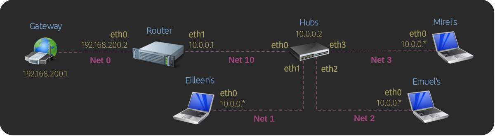
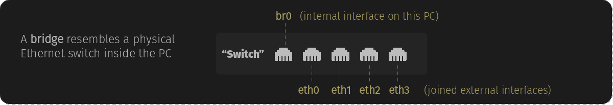

# Lab 3: Setting Up DHCP and Bridges
                   

                                                                                         
## Overview

This lab exercise demonstrates the concept of bridges. This network is broken down as follows: 
                                                                                              
- **Router** This is the lab router. It has a DHCP server that provides IP addresses for everyone in the network
  and also serves as a NAT gateway to allow computers on the network to reach the Internet.

- **Hubs** is a small form factor fanless Linux PC with multiple Ethernet ports. It hosts the lab's Intranet 
  website at address _10.0.0.2_, and the machine's spare Ethernet ports are used for people to connect 
  their computers to the network.

- **Eilleen, Emuel**, and **Mirel** laptops are set up as DHCP clients. When they connect to the network,
  they can access the **Hubs** website and also can get to the Internet via **Router**.


## Building the Lab Network

To build the network for this lab exercise do the following:

- Change into the `netlabs/` directory and run:
    
    ```bash
    ./netlabs.sh  build  hubs,10,1,2,3  eilleen,1  emuel,2  mirel,3  router,0,10 
    
    ```
  
- Open shell terminals to all machines: 
                     
  - On graphical desktop environments run `./netlabs.sh terms` to open a new terminal window. 
  - If connecting via ssh to your test environment use `./netlabs.sh attach`, then to detach use CTRL-A, D. 


## Configuring 'Router' as a Gateway and DHCP Server
       

### Enable Forwarding

To make **Router** work as a gateway, we need to enable packet forwarding:

```bash
# Enable forwarding
sudo sysctl -w net.ipv4.ip_forward=1  

# Check forwarding is enabled, should print 1
cat /proc/sys/net/ipv4/ip_forward

```

### Masquerade Upstream Outgoing Traffic    

To ensure the packets sent to upstream gateway return back to us, we need to masquerade
the original source IP address as if it was ours. To do this, we use the `iptables` command
as follows:

```bash
# masquerade traffic heading the upstream gateway as if it was ours
sudo iptables -t nat -A POSTROUTING --source 10.0.0.0/24 -o eth0 -j MASQUERADE

# list nat rules
sudo iptables -t nat -nv -L POSTROUTING --line-numbers  

```

The above rule is added to `POSTROUTING` chain of the `nat` table; which holds rules 
for packets about to leave the machine. The rule says that any packet coming from 
the `10.0.0.0/24` network and leaving the `eth0` interface needs to be masqueraded, 
i.e., the packet's source IP address is replaced with the server's IP assigned to 
the interface where the packet is leaving from: `eth0` has IP _192.168.200.2_.
               

### Make Configuration Persistent

The settings above will be lost after a reboot. We use the `iptables-save` command
to save the current `iptables` rules to a file; the file location is arbitrary:

```bash
# Save current rules
sudo sh -c "iptables-save > /etc/iptables-rules.v4" 

```

Then we append instructions to the `/etc/rc.local` boot script to restore both forwarding
and `iptables` rules after boot. 

```bash
cat <<EOF | sudo tee -a /etc/rc.local
#!/bin/sh

# restore forwarding
sysctl -w net.ipv4.ip_forward=1

# restore rules
$(which iptables-restore) < /etc/iptables-rules.v4
EOF

# make file executable if not already done so
sudo chmod +x /etc/rc.local

```

Note that if `/etc/rc.local` does not exist it will be created.

Alternatively, you could enable forwarding permanently by editing `/etc/sysctl.conf`
and adding, or uncommenting, the line `net.ipv4.ip_forward=1`. Either way is fine.

```bash
sudo nano /etc/sysctl.conf

```


### Configure Network Interfaces

To configure the network interfaces, we are going to create a _netplan_ configuration

   
```bash
# Remove the default config, you may back up this folder if you like
sudo rm /etc/netplan/* 

# Set IPs, default route,  and DNS servers
cat <<EOF | sudo tee /etc/netplan/my-network-config.yaml 
network:
  version: 2
  ethernets:
    eth0:
      dhcp4: false
      addresses:
        - 192.168.200.2/24
      routes:
        - to: default
          via: 192.168.200.1
      nameservers:
        addresses: [127.0.0.1]
    eth1:
      dhcp4: false
      addresses:
        - 10.0.0.1/24
EOF

# Limit file access to root only
sudo chmod 600 /etc/netplan/* 

# Apply netplan config
sudo netplan apply

```

The above configuration does:

  - Assigns `192.168.200.2` to `eth0` so that we can talk to the upstream gateway. 
    Note DHCP is disabled in this interface as well.
  - Sets the default route via the `192.168.200.1` gateway.
  - Set the DNS server as ourselves `127.0.0.1`. This is because later we are installing
    `dnsmasq` to handle name resolution in this machine. Otherwise, this is where we would 
    have put public DNS servers such as _8.8.8.8_ and _1.1.1.1_.
  - Assigns `10.0.0.1` to `eth1` and disable DHCP in this interface too.

                                          
### Setup DNS and DHCP for the 10-Network
                     
To install _dnsmaq_ using _apt_ we need to set up a temporary DNS config:  
                                                                         
```bash
# Create config folder if not exist, this is the folder
# systemd-resolved reads user-defined DNS configurations from
sudo mkdir -p /etc/systemd/resolved.conf.d  

# Create a custom DNS setting for systemd-resolved so that we can reach the apt repos
cat <<EOF | sudo tee /etc/systemd/resolved.conf.d/manual-dns.conf
[Resolve]
DNS=8.8.8.8
EOF

# Restart systemd-resolved
sudo systemctl restart systemd-resolved 

# Test dns
ping -c1 ubuntu.com # Ok

```

Now we are ready to use _apt_ to install _dnsmasq_:
                            
```bash
# Install dnsmasq
sudo apt update && sudo apt install -y dnsmasq

```

Now update _systemd-resolved_ again, this time we set `DNSStubListener=no` 
so that _systemd-resolved_ doesn't bind to localhost port 53 (DNS) and
do name resolution for this machine. Port 53 is going to be used by 
_dnsmasq_ later on:

```bash
# Notice systemd-resolved is listening on local port 53
sudo netstat -tulpn 

# Save new systemd-resolved config, release port 53
cat <<EOF | sudo tee /etc/systemd/resolved.conf.d/manual-dns.conf
[Resolve]
DNSStubListener=no
EOF

# Restart systemd-resolved
sudo systemctl restart systemd-resolved 

# Confirm systemd-resolved is no loger listening on local port 53
sudo netstat -tulpn 

# Confirm the name server points to localhost 127.0.0.1
# Tip: in the past /etc/resolv.conf is where you would put your DNS servers, 
#      but these days this file is managed by systemd and any changes  
#      made to it will be overwritten and this file is now auto-generated.
cat /etc/resolv.conf 

```
                         
Now it is time to create the _dnsmasq_ configuration and start the server:

```bash
# Create basic dnsmasq config file
cat <<EOF | sudo tee /etc/dnsmasq.conf
# Specify the domain name given to DHCP clients
domain=local.lan

# Queries on this domain are not sent upstream
server=/local.lan/

# Ignore /etc/hosts, overwrite Router address
no-hosts
address=/router.local.lan/10.0.0.1

# Avoid upstream reverse-dns lookups of private IPs: 10. 192. 172.
bogus-priv

# Only fully qualified domain names are sent upstream
# Add domain name suffix to plain names automatically
domain-needed
expand-hosts

# Don't use /etc/resolv.conf, use the following DNS servers
no-resolv
server=8.8.8.8
server=8.8.4.4

# Specify network interface to bind to (in addition to :lo)
bind-interfaces
interface=eth1

# Assign IPs in incremental order in this IP range, netmask, and lease time
dhcp-sequential-ip
dhcp-range=10.0.0.100,10.0.0.254,255.255.255.0,1h

# Assign hubs a specific IP based on its MAC address
dhcp-host=12:34:56:78:9a:bc,10.0.0.2


# Log DHCP/DNS queries, see with journalctl -f, comment out in production
log-dhcp
log-queries
EOF

# Restart dnsmasq to reload the configuration
sudo systemctl restart dnsmasq

# Confirm dnsmasq is listening on local port 53
sudo netstat -tulpn 

```

Note this is an opinionated configuration to serve the purpose of this lab 
exercise. To learn more about `dnsmasq` see the docs at
https://dnsmasq.org/docs/dnsmasq-man.html.
      
The above configuration does the following:

  - `domain=local.lan` and `server=/local.lan/` set
    the domain name for our lab network computers. Queries 
    on this domain are not sent upstream and are resolved locally.

  - `no-hosts` and `address=/router.local.lan/10.0.0.1`
    tell _dnsmasq_ to ignore the contents of `/etc/hosts` and
    that if anyone queries the address of _router_ the response
    will be _10.0.0.1_. Note that you could have replaced these
    config lines with a `10.0.0.1 router.local.lan` entry in `/etc/hosts`, 
    but if in the future you needed to change the network 
    addresses, you would have to change two files: `/etc/hosts` and
    this _dnsmasq_ configuration file. 
                                     
  - `bogus-priv` tells _dnsmasq_ not to perform reverse-dns 
    lookups of private IP addresses: 10.x.x.x, 192.168.x.x, 
    172.16.x.x-172.31.x.x. If your DNS is slow, you are probably 
    missing this setting.
       
  - `domain-needed` and `expand-hosts` specifies that only fully 
    qualified domain names are sent upstream. If anyone queries a
    plain name, the local domain name suffix will be added automatically.
                                                                         
  - `no-resolv` tells _dnsmasq_ to ignore the name servers specified
    in `/etc/resolv.conf` (which currently points to ourselves 127.0.0.1).
    Instead, a series of `server=` entries are used to specify the
    DNS server we want to use for name resolution, in this case
    _8.8.8.8_ and _8.8.4.4_.

  - _dnsmasq_ default behavior is to listen in all interfaces. By using the
    `bind-interfaces` and `interface=eth1` we are telling it to listen 
    on the _eth1_ interface, in addition to the loopback interface _lo_.

  - `dhcp-sequential-ip` and `dhcp-range=10.0.0.100,10.0.0.254,255.255.255.0,1h`
    specify we want to assign IPs in incremental order in the given IP range, 
    netmask, and lease time.

  - `dhcp-host=12:34:56:78:9a:bc,10.0.0.2` tells _dnsmasq_ to assign
    the IP _10.0.0.2_ to the machine with MAC address _12:34:56:78:9a:bc_.
    This is the IP address we are going to use for **Hubs** instead
    of letting the server assign one from the pool of IP addresses.

  - `log-dhcp` and `log-queries` tells _dnsmasq_ to log all the DNS and DHCP
    transactions. These logs can be seen `sudo journalctl -f`. Note that
    these settings should be commented out in production to prevent
    clogging the system logs with verbose DNS and DHCP information.

        
At this point, we can restart _Router_ and see if the configuration persists.
```bash
# Restart server
sudo reboot

# list nat rules
sudo iptables -t nat -nvL --line-numbers  

# Show current forwarding setting
sysctl net.ipv4.ip_forward  


# Monitor DNS and DHCP log activity
sudo journalctl -f | grep -iE '(dns|dhcp)'

```

 
## Set Up Hubs

_Hubs_ should operate as a dumb switch. All its interfaces should be able to talk
to each other freely and without restrictions. In addition, _Hubs_ webserver
should be reachable at IP address 10.0.0.2.

We can achieve this by creating an internal bridge and connect all the physical 
interfaces to it:

```bash
# Create a bridge named br0 with MAC address 12:34:56:78:9a:bc
sudo ip link add br0 address 12:34:56:78:9a:bc type bridge

# Attach all the eth interfaces to the bridge 
sudo ip link set eth0 master br0

sudo ip link set eth1 master br0

sudo ip link set eth2 master br0

sudo ip link set eth3 master br0

# Bring the bridge up so that traffic among the interfaces can begin
sudo ip link set br0 up 

# show interfaces, notice eth adapters has br0 as master
# and br0 MAC address is 12:34:56:78:9a:bc
ip link

# Monitor traffic through the bridged network
sudo tcpdump -i any -ln

```

After the bridge went UP, traffic started to flow through. Machines would begin
to issue DHCP requests to get their IP addresses.
                          

### How does it work?          

A bridge is nothing more than a software representation of a physical network switch.
This picture represents our configuration from above:



The bridge joins together _eth0_, _eth1_, _eth2_, _eth3_ along with the newly created
interface _br0_, which is how the host machine connects to the bridged network.

We assigned a custom MAC address to the _br0_ interface instead of letting the system 
pick one randomly for us. We did this because earlier we configured _dnsmasq_ to assign
the machine with MAC 12:34:56:78:9a:bc the IP address of _10.0.0.2_. 
   
>[!IMPORTANT] 
> Locally-administered private MAC addresses have the second hex digit as 2, 6, A, or E,
> so they do not conflic with commercially assigned ones, for example:
> - x2:xx:xx:xx:xx:xx
> - x6:xx:xx:xx:xx:xx
> - xA:xx:xx:xx:xx:xx
> - xE:xx:xx:xx:xx:xx


### Make Configuration Persistent          

At this point, you will notice _br0_ doesn't yet have an IP address. This is because the interface
_br0_ is not yet configured as a DHCP client. In addition, all the configuration above will be 
lost after a reboot. 
                                                                     
The following netplan configuration will restore everything after boot and also set _br0_ to get
its IP address via DHCP:

```bash
# Remove the default config, you may back up this folder if you like
sudo rm /etc/netplan/* 

# Specify bridge interfaces and set br0 to DHCP
cat <<EOF | sudo tee /etc/netplan/my-network-config.yaml
network:
  version: 2
  ethernets:
    eth0:
      dhcp4: false
    eth1:
      dhcp4: false
    eth2:
      dhcp4: false
    eth3:
      dhcp4: false
  bridges:
    br0:
      dhcp4: true
      macaddress: "12:34:56:78:9a:bc"
      interfaces: [eth0, eth1, eth2, eth3]
EOF

# Make file accessible only by root
sudo chmod 600 /etc/netplan/* 

# Apply configuration
sudo netplan apply

```

Shortly after this _br0_ might get its IP address, nevertheless, reboot the server to
confirm our configuration is working.

```bash
# Reboot Hubs
sudo reboot

# Check IP addresses after reboot
ip -brief addr

```


## Set Up Other Clients

By default, Ubuntu systems are set to DHCP by default, so there is no 
need to configure _Mirel_, _Eilleen_, _Emuel_ to DHCP.
 
Had you had the need to set them to DHCP, this is how it is done:                                                      

```bash
# Remove the default config, you may back up this folder if you like
sudo rm /etc/netplan/* 

# Set eth0 to DHCP
cat <<EOF | sudo tee /etc/netplan/my-network-config.yaml 
network:
  version: 2
  ethernets:
    eth0:
      dhcp4: true
EOF


# Make the file accessible only by root
sudo chmod 600 /etc/netplan/* 

# Apply configuration
sudo netplan apply

```


## Test Systems Connectivity

Reboot all DHCP clients: _Hubs, Mirel, Eilleen, Emuel_. 
They should all pick their IP addresses from _Router_.

```bash
sudo reboot   # Run on Hubs, Mirel, Eilleen, Emuel

```

Everyone should be able to reach each other using names, 
as well as reaching machines on the Internet.

```bash
# Ping each other, use grep to shorten output
(ping -c1 hubs && ping -c1 eilleen && ping -c1 mirel && ping -c1 emuel \
     && ping -c1 router && ping -c1 google.com) | grep -A1 '^---'  


# Curl each other, websites
curl router && curl hubs && curl eilleen && curl mirel && curl emuel

```
    
                
     
